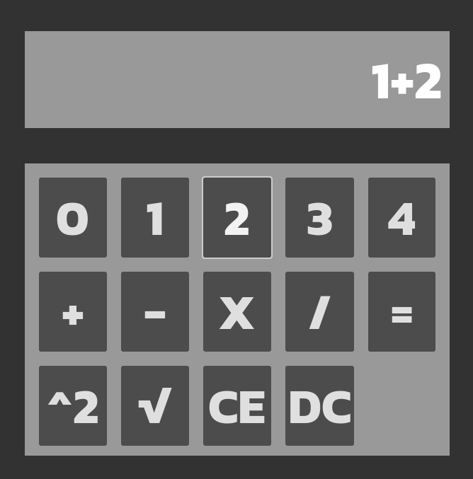

# Quinary Calculator

 

## How to Use Calculator
 - Run calculator.exe on a Windows computer
 - Enter a number between 0 - 5, then a basic calculator operation (plus, minus, multiply, divide, square, square root), then press equals to view the calculation result in quinary number format
 - Hold the DC button to view the answer in decimal number formal, otherwise all numbers will be shown in quinary number format
 - Press CE to clear all numbers from the calculator memory

## Dependencies
 - There are no dependencies required for this project
## Task Distributions
 - Gabe Manning = Added division functionality and appropriate tests
 - Camden Hovell = Created all UI and GUI functions, Github, Slack, cleaned code to match Godot style guidelines better
## Meetings
 - 8/29 from 2-2:45pm, Gabe Manning and Camden Hovell, Letterman lobby, teaching Gabe how to use Godot because he was the only one who hadn't used the engine before
